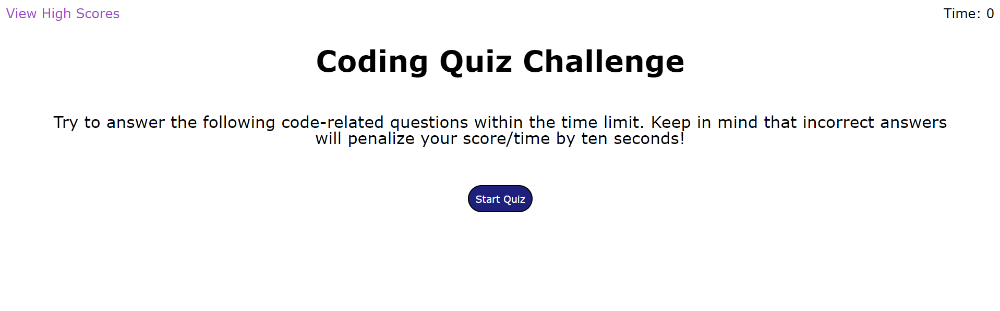
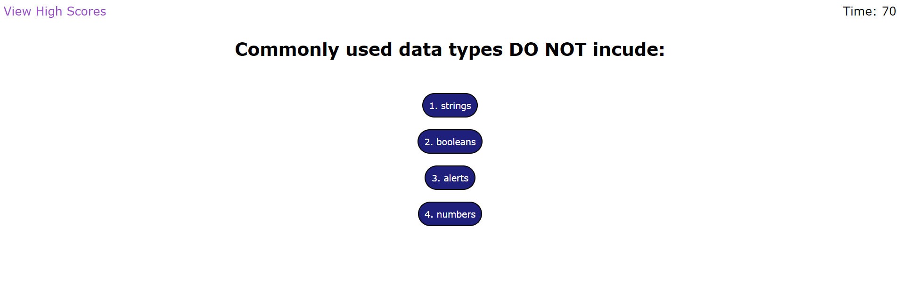
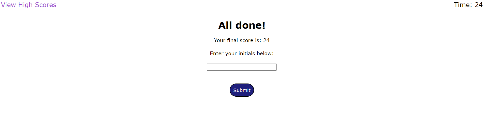

# Timed Code Quiz

https://juliaghany.github.io/Timed-Code-Quiz/

 

## Description

- My motivation for this project was to create an HTML, CSS, and JavaScript files from scratch in order to create a timed multiple choice question quiz. 
- I built this project so that the user can test their knowledge on coding with a set of technical interview questions. I also built this project to practice the new skills we've learned in this course. For example, building HTML, CSS, and JavaScript code without a starter code. 
- I learned how to start a timer after a click event, and how to hide and display certain parts of my HTML using style/display in HTML and JavaScript. I learned how to change text content in the HTML using JavaScript. I learned how to create a function that would submit user input to storage using a submit form, and how to load that storage on the High Scores page. I also learned how to direct the user to the High Scores page after clicking on the submit button. I learned how to create and append a child element through JavaScript (this was done in my highscores.js file), and I learned how to clear local storage and the text content on the High Scores page. I learned how to use an array of objects for my questions, answers, and correct answer. I also used an array within this array of objects for my possible answers. I was able to create click events on my answer buttons, so that the next question would appear on the page after the user clicked on an answer. I also learned how to use target.matches to make sure the user clicked on an actual answer button instead of just anywhere in the questions container. I learned how to deduct 10 seconds from the timer if the user selected the wrong answer, which also deducted 10 points from the user's score. I also learned how to end the quiz if the timer reaches zero seconds; once it does, the webpage will take the user to the end quiz page where they can submit their initals. I also learned how to create functions that would indicate to the user whether they selected the correct or wrong answer. I learned how to use onmouseover to hide the "Correct!" or "Wrong!" once the user hovered their mouse over an answer button or the submit button. I learned how to link my High Scores page to my main page, and how to create a button that took the user from the High Scores page to the main page once they clicked on it. 
- I noticed that my timer has somewhat of a lag at the end. I'm not sure why this is happening or how to go about fixing this, but I wanted to acknowledge this here. 

## Usage

- To use this webpage, you will click on the "Start Quiz" button. Once you've clicked this button, the first question of the multiple choice quiz will appear. Once you select an answer, the webpage will tell you if you selected the correct or wrong answer and the next question will appear. If you selected the wrong answer, 10 seconds will be deducted from the timer and 10 points will be deducted from your score. If you do not finish the quiz within 75 seconds, the webpage will take you to the end of the quiz. Once you reach the end of the quiz, you can submit your initals to the score page. Once you click submit, you will be taken to the High Score page. There you will see the score that you've submitted. If you'd like to go back to the beginning of the quiz, you can click on the "Go Back" button. If you'd like to clear your score, you can click on the "Clear High Scores" button. 
  
## Credits

- I referenced this webpage for how to store my questions, answers, and correct answer in JavaScript. I chose to store my answers in an array instead of the way that the example showed on this website. // https://www.sitepoint.com/simple-javascript-quiz/ 
- I referenced this website for my submit form: https://www.w3schools.com/html/html_forms.asp
- I referenced this website to remove the list elements in my High Scores page: https://www.geeksforgeeks.org/remove-all-the-child-elements-of-a-dom-node-in-javascript/
- I referenced this website for the onmouseover that I applied to my answer buttons and submit button: https://www.w3schools.com/jsref/event_onmouseover.asp
- I referenced Module 4 Activity 26 for lines 16-20 in my highscores.js file. 
- I referenced this website to figure out how to clear local storage for my high scores: https://developer.mozilla.org/en-US/docs/Web/API/Storage/clear
- My instructor, Diego, helped me create a variable for the current question the user was viewing and a function that showed the questions one after the other using currentQuestion++. He also helped me figure out how to create a function that showed the current question and the possible answers for that question on the page. 
- My tutor, Alexis Gonzalez, helped me figure out how to subtract 10 from the timer/score. He also helped me create my endQuiz function, handleFormSubmit function, saveToStorage function, and loadStorage function. He taught me how and why these functions work together to make the quiz function properly. He also helped me get started with my High Scores HTML and JavaScript files. 
- AskBCS helped me get started on this project by suggesting that I create sections in my HTML for each page. AskBCS also helped me figure out how to take the user to the high scores page after clicking on the submit button on the end quiz page, and how to make the high scores appear on the high score page in a more visually appealing way. 